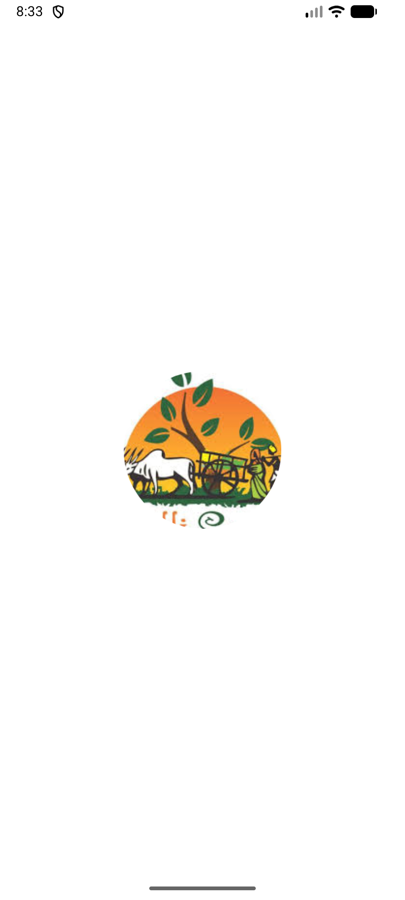
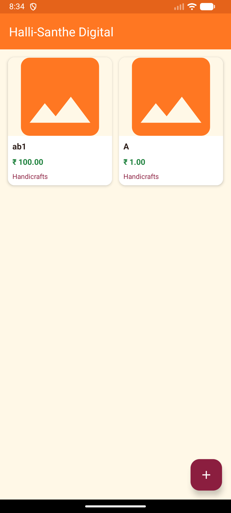
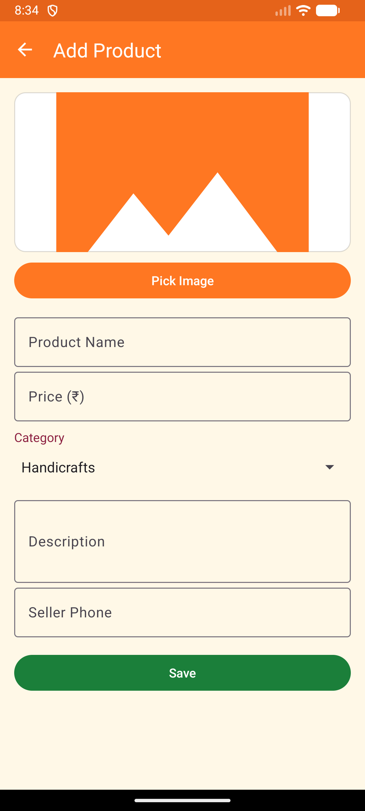
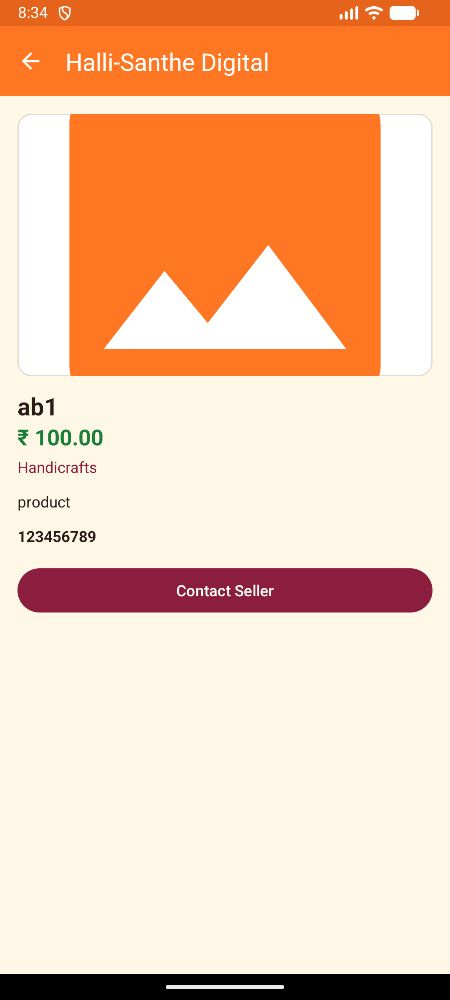
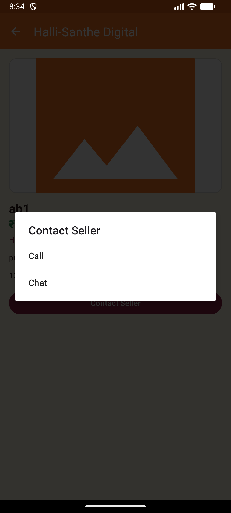

# 🛍️ Halli-Santhe Digital
### Hyper-Local Marketplace Android Application for Rural Artisans

Halli-Santhe Digital is a hyper-local Android marketplace application designed to digitally connect rural artisans and local sellers with buyers. The application acts as a digital catalog for traditional village markets (“Halli Santhe”), helping artisans showcase their handmade products and enabling buyers to browse products before visiting physical markets.

The project promotes the **“Vocal for Local”** initiative by supporting local businesses and preserving traditional crafts through digital commerce.

---

# Download APK

[Download APK](apk/app-debug.apk)

---

# Features

* Add and manage artisan products
* Upload product image, name, category, and price
* Browse products in grid layout
* Product detail screen with call-to-action
* Search functionality for products
* Empty state handling when no products exist
* Offline/local data storage using Room Database
* Simple and colorful traditional market-inspired UI
* Smooth image loading and display

---

#  Technologies Used

| Technology | Purpose |
|---|---|
| Kotlin | Android application development |
| Android Studio | Development environment |
| Room Database | Local offline data storage |
| RecyclerView | Product listing display |
| GridLayoutManager | Grid-based marketplace UI |
| MVVM Architecture | Code organization and maintainability |
| Glide | Image loading and caching |
| Material Design 3 | Modern UI components |
| Kotlin Coroutines | Background operations |
| LiveData & ViewModel | Lifecycle-aware UI updates |

---

# Libraries Used

* Room Database
* RecyclerView
* Glide
* AndroidX Libraries
* Material Components
* Lifecycle (ViewModel & LiveData)
* Kotlin Coroutines

---

# Modules

## 1. Splash Screen

Displays the application logo and initializes required components.

---

## 2. Product Management Module

Allows artisans to:
- Add products
- Update products
- Delete products
- Upload product images

---

## 3. Marketplace Module

Displays all products in a colorful grid layout using RecyclerView and GridLayoutManager.

---

## 4. Product Detail Module

Displays:
- Product image
- Product price
- Product description
- Seller interaction button

---

## 5. Search Module

Allows buyers to search products by:
- Product name
- Category

---

## 6. Offline Storage Module

Stores product data locally using Room Database for offline functionality.

---

# Project Structure

```plaintext
HalliSantheDigital/
│
├── app/
│   │
│   ├── src/main/
│   │   │
│   │   ├── java/com/halli/santhe/
│   │   │   │
│   │   │   ├── data/
│   │   │   │   ├── AppDatabase.kt
│   │   │   │   ├── Product.kt
│   │   │   │   ├── ProductDao.kt
│   │   │   │   └── ProductRepository.kt
│   │   │   │
│   │   │   ├── ui/
│   │   │   │   ├── activity/
│   │   │   │   ├── adapter/
│   │   │   │   └── viewmodel/
│   │   │   │
│   │   │   ├── MainActivity.kt
│   │   │   └── AddProductActivity.kt
│   │   │
│   │   ├── res/
│   │   │   ├── drawable/
│   │   │   ├── layout/
│   │   │   ├── values/
│   │   │   ├── mipmap/
│   │   │   └── xml/
│   │   │
│   │   └── AndroidManifest.xml
│   │
│   ├── build.gradle.kts
│   └── proguard-rules.pro
│
├── gradle/
├── build.gradle.kts
├── settings.gradle.kts
├── gradle.properties
├── gradlew
├── gradlew.bat
├── .gitignore
└── README.md
```

---

# Database

The application uses Room Database for storing:

* Product details
* Product images
* Product categories
* Product pricing information

All data is stored locally for offline accessibility.

---

#  UI Design

The application UI is inspired by traditional Indian village markets with:
- Vibrant colors
- Simple navigation
- Grid-based product display
- User-friendly marketplace interface

---

# 📷 Screenshots

<p align="center">
  
  
  
</p>

<p align="center">
  
  
  
</p>

---

#  How to Run the Project

##  Prerequisites

Before running the project, ensure the following are installed:

- Android Studio
- JDK 17
- Android SDK
- Gradle
- Android Emulator or Android Device

---

# Method 1: Run Using Android Emulator

## Step 1: Clone Repository

```bash
git clone https://github.com/Sharan17design/HalliSantheDigital.git
```

---

## Step 2: Open Project

1. Open Android Studio
2. Click:
   ```plaintext
   Open Project
   ```
3. Select the project folder
4. Wait for Gradle sync

---

## Step 3: Create Emulator

1. Open:
   ```plaintext
   Tools → Device Manager
   ```
2. Create a virtual device
3. Download required Android image
4. Start emulator

---

## Step 4: Run Application

1. Click ▶ Run
2. Select emulator
3. App installs automatically

---

# Method 2: Run on Physical Android Device

## Step 1: Enable Developer Options

```plaintext
Settings → About Phone → Tap Build Number 7 times
```

---

## Step 2: Enable USB Debugging

```plaintext
Settings → Developer Options → USB Debugging
```

---

## Step 3: Connect Device

- Connect mobile via USB
- Allow debugging permission

---

## Step 4: Run Application

1. Click ▶ Run
2. Select connected device
3. App installs automatically

---

# Method 3: Install APK Directly

## Step 1: Build APK

```plaintext
Build → Build APK(s)
```

APK Location:

```plaintext
app/build/outputs/apk/debug/app-debug.apk
```

---

## Step 2: Transfer APK

Transfer using:
- USB
- WhatsApp
- Google Drive
- Bluetooth

---

## Step 3: Install APK

1. Open APK on mobile
2. Enable:
   ```plaintext
   Install from Unknown Sources
   ```
3. Install application

---

# Troubleshooting / Common Issues

## 1. Gradle Sync Failed

### Solution
- Check internet connection
- Verify Android SDK installation
- Sync Gradle files

---

## 2. Emulator Slow

### Solution
- Increase RAM allocation
- Enable virtualization

---

## 3. Device Not Detected

### Solution
- Enable USB debugging
- Use proper USB cable

---

## 4. Images Not Loading

### Solution
- Check image permissions
- Verify Glide dependency

---

## 5. App Crashes

### Solution
- Clean and rebuild project
- Verify Room Database implementation

---

## 6. Search Not Working

### Solution
- Verify RecyclerView adapter filtering logic
- Ensure product data exists

---

## 7. Data Not Saving

### Solution
- Check Room Database DAO methods
- Verify required fields

---

#  Future Enhancements

* Firebase cloud synchronization
* Online artisan registration
* AI-generated product descriptions
* WhatsApp seller integration
* Multi-language support
* Location-based product discovery
* Product ratings and reviews
* Voice search support

---

#  Impact Goals

* Empower rural artisans digitally
* Promote local village businesses
* Increase visibility for traditional crafts
* Support hyper-local commerce
* Preserve Indian cultural products

---

# Developer

Developed by Sharan H Amin
